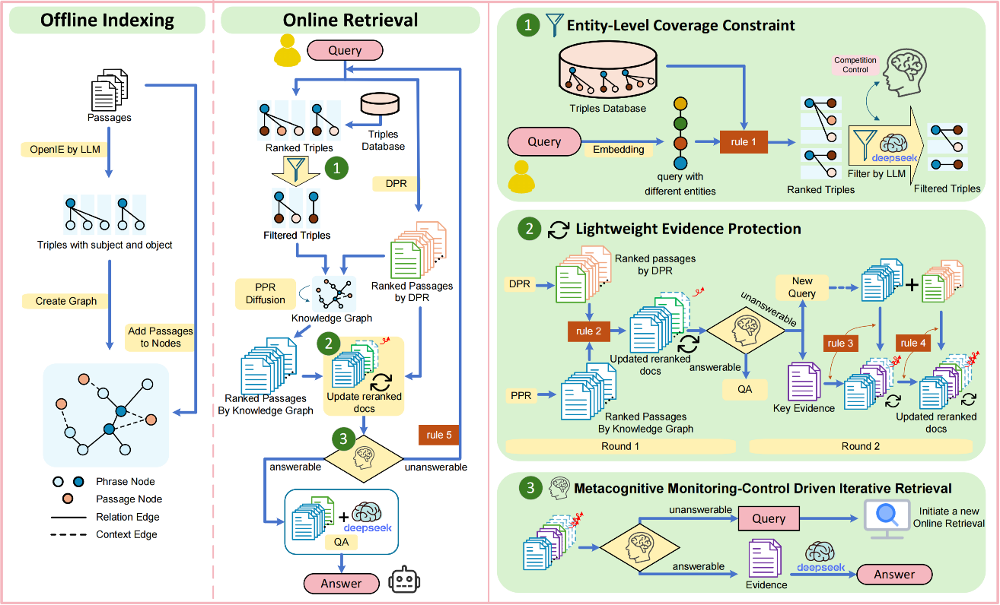
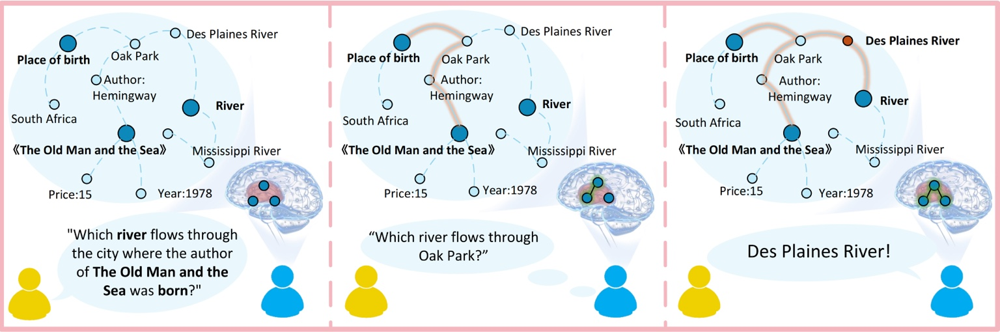
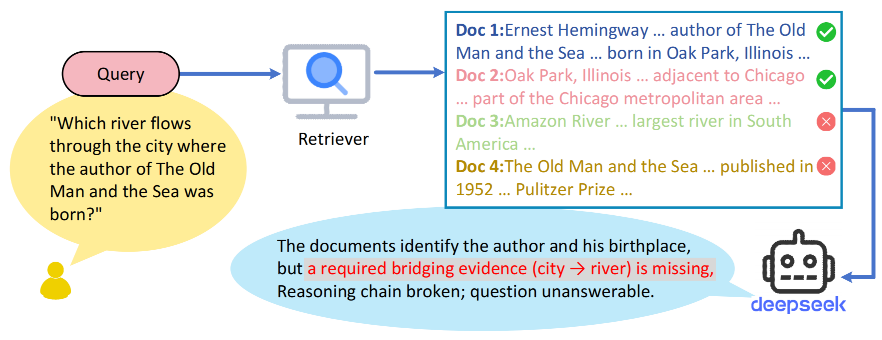
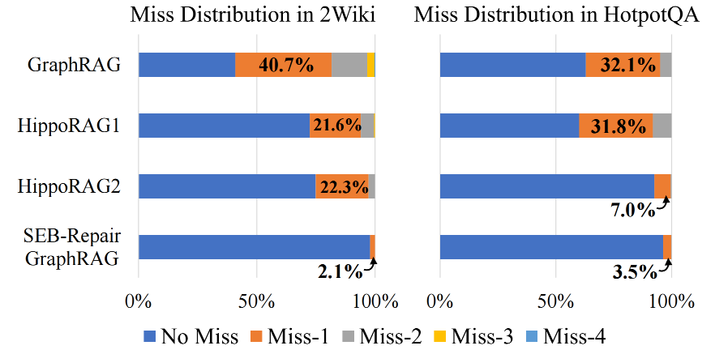

# SEB-Repair GraphRAG

<p align="center">
  
</p>

SEB-Repair GraphRAG is an enhanced implementation of the GraphRAG system for multi-hop QA, with a core focus on **Single Evidence Break (SEB):** Even in high recall settings, the inference chain may break due to the absence of a single crucial bridging piece of evidence. The project provides a basic workflow of **indexing/iterative retrieval/retrieval + question answering**, and supports the use of judge LLM to determine the answerability of the top-5 evidence and generate bridging questions, thereby triggering a second round of retrieval.

---

## Figures

<p align="center">
  
</p>

<p align="center">
  
</p>

<p align="center">
  
</p>

---

## Installation

```bash
conda create -n sebgraphrag python=3.10 -y
conda activate sebgraphrag
pip install -r requirements.txt
```

Optional backends are installed separately when selected: `requirements-vllm.txt`, `requirements-gritlm.txt`, or `requirements-sentence-transformers.txt`. The base installation does not eagerly import these backends.

---

## Environment Variables

```bash
export CUDA_VISIBLE_DEVICES=0
export TOKENIZERS_PARALLELISM=false

# HuggingFace cache
export HF_HOME=<path to Huggingface home directory>
export HF_ENDPOINT=https://hf-mirror.com
export HF_HUB_DISABLE_XET=1

# DeepSeek（OpenAI-compatible）
export DEEPSEEK_BASE_URL=https://api.deepseek.com
export DEEPSEEK_MODEL=deepseek-reasoner
export DEEPSEEK_API_KEY=YOUR_KEY
```

---

## Data Format

`main.py` By default, it reads from the following path:

- Corpus：`reproduce/dataset/{dataset_name}_corpus.json`
- Question Set：`reproduce/dataset/{dataset_name}.json`

### Corpus JSON (`*_corpus.json`)

```json
[
  {"title": "Doc Title", "text": "Doc content", "idx": 0},
  {"title": "Another Title", "text": "Another content", "idx": 1}
]
```

---

## Judge Prompt

The judge prompt uses a JSON configuration file:：

`src/SRgraphrag/prompts/dspy_prompts/judge_prompt.json`

Example Structure：

```json
{
  "system_prompt": "...",
  "user_prefix": "...",
  "doc_max_chars": 200000,
  "query_max_chars": 2000
}
```
---

## Quick Start

### 1) Retrieval Only

```bash
python main.py   --dataset 2wikimultihopqa   --mode retrieve   --llm_base_url https://api.deepseek.com/v1   --llm_name deepseek-chat   --judge_llm_name deepseek-reasoner   --embedding_name nvidia/NV-Embed-v2   --save_dir outputs   --result_save_root result_outputs   --test_n 1000   --subject_level_Entity_Cap 4
```

### 2) Retrieval + QA

```bash
python main.py   --dataset 2wikimultihopqa   --mode qa   --llm_base_url https://api.deepseek.com/v1   --llm_name deepseek-chat   --judge_llm_name deepseek-reasoner   --embedding_name nvidia/NV-Embed-v2   --save_dir outputs   --test_n 1000   --subject_level_Entity_Cap 4
```

---

## Outputs

- `outputs/{dataset}/`: Index and runtime artifacts (controlled by `BaseConfig(save_dir=...)`)

- QA results (currently in main.py): `outputs/{dataset}/rag_qa_{dataset}.json`

- If `--result_save_root` is enabled: Retrieval evaluations and miss buckets will be written to this directory

---

## Development

See the [codebase overview](docs/codebase_overview.md) for the current retrieval workflow and module boundaries, and the [Agent graph retrieval plan](docs/agent_graph_retrieval_plan.md) for the proposed implementation stages and validation criteria.

Run these lightweight offline checks from the repository root:

```bash
python3 -S main.py --help
python3 -S -m unittest discover -s tests -v
```

These checks use the Python standard library without loading model backends or calling external APIs. Passing them verifies the CLI and the covered offline behavior; it does not establish that indexing, model inference, retrieval, or QA works end to end. Full pipeline validation requires the runtime dependencies, datasets, model resources, and API configuration described above.

## Agent graph retrieval (opt-in, second round only)

The existing first-round PPR, fact-filter prompt, judge gate, and two-round limit remain the default. Add `--graph_search_mode agent` or `--graph_search_mode hybrid` to change only the gated second-round graph search. Hybrid uses a bounded PPR candidate region with boundary expansion. Directed facts and provenance come from the existing OpenIE cache, independently of the old weighted graph.

```bash
python main.py --dataset 2wikimultihopqa --mode retrieve \
  --llm_base_url https://api.deepseek.com/v1 --llm_name deepseek-chat \
  --judge_llm_name deepseek-reasoner --embedding_name nvidia/NV-Embed-v2 \
  --graph_search_mode agent --agent_apply_to round2 --agent_fallback ppr \
  --agent_max_steps 8 --agent_max_tool_calls 16 --agent_max_expansions 64 \
  --agent_max_neighbors 8 --agent_max_path_length 4 \
  --agent_max_tokens 12000 --agent_max_seconds 60 \
  --result_save_root result_outputs/agent_trial --test_n 20
```

Tools enforce observed IDs, direction, continuity, provenance and evidence capacity. Committed path sources and protected first-round evidence must fit together in Top-5. Unknown scores serialize as `null`. Fallback choices are `ppr` (default), `dpr`, and `none`; `none` retains the first round when no path is committed. The MVP's live Agent adapter supports OpenAI-compatible text backends.

For paired experiments, save a PPR two-round run, then use its `retrieval_trace.jsonl` with `--round1_replay_path PATH` for Agent and Hybrid. Use separate result roots to avoid overwriting trials. Replay fixes first-round evidence and judge outputs; gold evidence is never passed to the Agent.

```bash
python3 -S scripts/build_relation_index.py \
  --openie outputs/2wikimultihopqa/openie_results_ner_deepseek-chat.json --check-only

# Gold JSON: ordered [{"query": "...", "gold_docs": ["full passage", ...]}, ...].
# Compare against the frozen first-round PPR output.
python3 -S scripts/evaluate_repair.py \
  --trace result_outputs/agent_trial/2wikimultihopqa/ITER_cap4_agent/retrieval_trace.jsonl \
  --gold gold_evidence.json --baseline-mode round1 --output repair_report.json
```

With runtime dependencies installed, `python -m unittest discover -s tests -v` also runs real small-graph PPR and strategy integration tests. See [implementation and validation notes](docs/implementation_status.md) for tested scope and limitations. This implementation is not a claim of improved benchmark accuracy.
